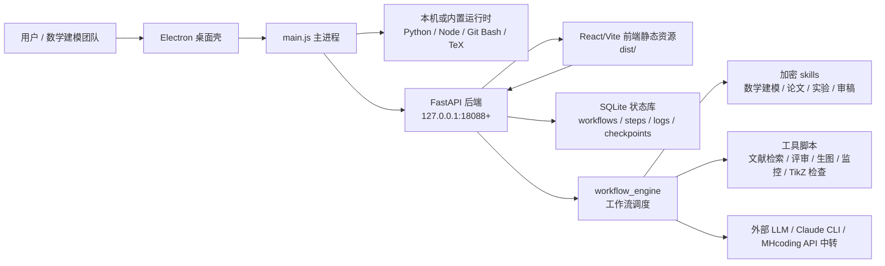

# Modex-MH-Agent

Modex-MH-Agent 是一个面向数学建模、科研实验和论文写作的桌面端 AI Agent 应用。当前仓库整理自已打包应用中的核心应用目录 `resources/app`，重点保存可读入口、后端接口、前端构建产物、工作流模板、工具脚本和加密 skill 资产；未纳入 Electron 外壳二进制、Python/Node/TeX/Git 运行时和安装包。

## 架构总览



应用采用“桌面壳 + 本地 Web 后端 + 静态前端 + skill 工作流”的架构：

- Electron 主进程负责启动后端、探测端口、注入运行时环境、加载窗口和托盘管理。
- FastAPI 后端提供工作流、产物、检查点、设置、编辑器 AI、WebSocket 和激活校验接口。
- 前端是已构建好的 SPA，通过 `/api/*` 与后端交互，通过 `/ws` 接收工作流日志和状态更新。
- 工作流引擎从加密 skills 和模板中组织数学建模任务，包括选题、建模、实验、代码、论文、编译、图表和审稿闭环。
- SQLite 表结构记录 workflow、step、log、checkpoint 和 settings，用于恢复中断任务与前端展示。

## 目录说明

```text
app/
  main.js                         Electron 主进程，启动 Python 后端并创建窗口
  preload.js                      暴露极少量桌面环境信息给渲染进程
  package.json                    Electron 应用元信息
  backend/
    main.py                       FastAPI 入口、路由注册、激活中间件、静态前端托管
    requirements.txt              后端 Python 依赖
    db/schema.sql                 SQLite 数据表结构
    routers/*.pyc                 工作流、产物、检查点、设置、编辑器、WebSocket 路由
    services/*.pyc|*.pyd          状态存储、工作流引擎、LLM、Claude runner、license guard
  dist/
    index.html                    前端入口
    assets/                       前端 JS/CSS 与 KaTeX 字体等构建产物
    logo.svg / favicon.svg        UI 资源
  skills/
    *.enc                         加密后的 Agent skills、模板和共享脚本
  templates/
    *.md                          工作流输入与中间产物模板
  tools/
    scholar_fetch.py              Semantic Scholar / CrossRef / DBLP 文献与 BibTeX 工具
    reviewer_client.py            OpenAI 兼容接口评审客户端
    gpt_image.py                  GPT Image 2 学术插图生成工具
    tikz_vision_check.py          TikZ 图视觉自检工具
    watchdog.py                   远程训练/下载任务监控守护进程
```

## 启动链路

1. `app/main.js` 判断是否为打包模式，并定位 `resources/app` 与同级 `runtime`。
2. 默认从 `18088` 开始寻找可用端口，最多尝试 10 个连续端口。
3. 启动 `python -m uvicorn main:app --host 127.0.0.1 --port <port>`，工作目录为 `app/backend`。
4. 将 Python、Node、TeX 和 Git Bash 路径加入后端进程 `PATH`，并设置 `MH_DESKTOP=1`、`API_PORT`、UTF-8 相关环境变量。
5. 轮询 `/api/health` 等待后端就绪。
6. 创建 Electron `BrowserWindow`，加载本地 FastAPI 托管的 SPA。
7. 退出桌面应用时结束 Python 子进程。

## 后端模块

`backend/main.py` 是后端入口，核心职责如下：

- 使用 FastAPI lifespan 初始化数据库。
- 将 WebSocket 广播函数注入 workflow engine。
- 启动时检查本地 license，并为需要解密 skills 的工作流准备密钥。
- 自动恢复后端重启前处于运行态的工作流。
- 启动心跳检测，周期性恢复异常中断的工作流。
- 注册 `workflows`、`artifacts`、`checkpoints`、`settings`、`editor`、`ws` 路由。
- 在桌面模式下托管 `dist/` 前端静态资源，并提供 SPA fallback。

主要 API 面向以下能力：

- `/api/health`：健康检查。
- `/api/templates`：返回可用工作流模板及其步骤信息。
- `/api/license/verify`、`/api/license/status`：激活码验证与状态查询。
- `/api/workflows...`：工作流创建、运行、暂停、恢复和状态管理。
- `/api/artifacts...`：工作区文件、报告、PDF、图片等产物访问。
- `/api/checkpoints...`：人工检查点与反馈确认。
- `/api/settings...`：LLM、Claude CLI、GPT Image 等配置。
- `/ws`：实时日志与进度推送。

## 数据模型

SQLite schema 位于 `app/backend/db/schema.sql`，包含 5 类核心表：

- `workflows`：工作流实例，记录模板、标题、参数、状态、当前步骤和工作区路径。
- `workflow_steps`：工作流步骤，记录 skill 名称、顺序、状态、检查点类型、输出文件和错误信息。
- `workflow_logs`：运行日志，支持 info/warn/error/progress 等级。
- `checkpoints`：人工确认节点，保存展示数据、用户响应和处理状态。
- `settings`：键值配置，保存 LLM、Claude CLI、生图等运行参数。

## Skills 与数学建模能力

`app/skills` 目录保存加密 skill 包，覆盖的主要能力包括：

- 数学建模：`comp-modeling`、`comp-prob-analysis`、`comp-stats-topic`。
- 竞赛论文：`comp-paper-zh`、`comp-paper-en`、`paper-write-zh`、`paper-plan-zh`。
- 代码与实验：`comp-code`、`run-experiment`、`experiment-plan`、`monitor-experiment`。
- 图表与排版：`paper-figure`、`paper-figure-drawio`、`mermaid-diagram`、`nature-figure`、`paper-compile-zh`。
- 科研流程：`idea-discovery`、`research-lit`、`research-review`、`auto-review-loop`、`research-refine-pipeline`。
- 写作闭环：`paper-write`、`paper-writing`、`rebuttal`、`proof-writer`、`grant-proposal`。

这些 skills 通过后端的 workflow engine 调度，并依赖 license guard 获取解密密钥后才能执行。

## 工具脚本

- `scholar_fetch.py`：面向论文检索和引用生成，使用 Semantic Scholar、CrossRef、DBLP 三级 fallback。
- `reviewer_client.py`：调用 OpenAI 兼容 Chat Completions API，用于外部 LLM 审稿。
- `gpt_image.py`：调用 GPT Image 2 接口生成论文插图，并可转出 PDF 供 LaTeX 使用。
- `tikz_vision_check.py`：调用视觉模型检查 TikZ 编译图是否存在截断、重叠、布局问题。
- `watchdog.py`：适合远程服务器使用，监控训练或下载任务的 session、GPU 利用率和文件增长情况。

## 运行说明

当前仓库不是完整安装包，缺少原打包目录中的大体积运行时：

- Electron/Chromium 根目录文件和 `.exe`。
- `runtime/python`、`runtime/node`、`runtime/git`、`runtime/texlive`、`runtime/draw.io`。
- MiKTeX 安装器与其他随包二进制依赖。

如果只需要启动后端和前端静态页面，可在 Windows + Python 3.11 环境中尝试：

```powershell
cd app\backend
python -m pip install -r requirements.txt
$env:MH_DESKTOP="1"
$env:API_PORT="18088"
python -m uvicorn main:app --host 127.0.0.1 --port 18088
```

然后访问 `http://127.0.0.1:18088`。由于部分服务模块是 `cp311-win_amd64.pyd`，建议使用 Windows 64 位 Python 3.11。加密 skills、激活校验、Claude CLI、TeX 编译和图像生成等功能还需要相应 license、API Key 和外部工具链。

## 配置项

前端设置页会写入后端 settings，常见键包括：

- `executor_api_key`、`executor_model_id`：执行者 Agent。
- `reviewer_api_key`、`reviewer_model_id`：审稿者 Agent。
- `editor_ai_api_key`、`editor_ai_model_id`：编辑器 AI 助手。
- `gpt_image_api_key`：论文插图生成。
- `claude_bin`：Claude CLI 可执行文件路径，默认 `claude`。

默认 Base URL 指向 MHcoding API 中转服务：`https://www.mhcoding.xyz/`。

## 仓库边界

本仓库保存的是应用核心文件，便于审阅架构、备份关键资产和后续二次整理。它不包含完整源码工程、前端源码、构建脚本、运行时环境和安装器；如需完整复现桌面安装包，需要补齐原始工程和打包流水线。
